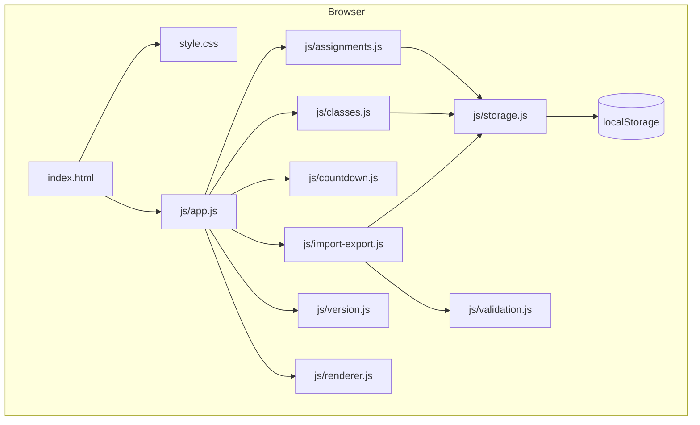

# Design Document: DueIt — Homework Planner

## Overview

DueIt is a client-side single-page application for students to manage homework assignments. It runs entirely in the browser with no backend — all data is persisted in `localStorage`. The app supports full CRUD for assignments and classes, two-stage progress tracking (complete / turned-in), a persistent assignment tracker with countdown timers, JSON export/import with round-trip integrity, and a responsive layout from 320px to 1920px.

### Technology Stack

| Layer | Choice | Rationale |
|-------|--------|-----------|
| Markup | HTML5 | Semantic, accessible, no build step |
| Styling | CSS3 | Separate `style.css`, media queries for responsive design |
| Logic | Vanilla JavaScript (ES6+) | No framework overhead, runs directly in the browser |
| Modules | ES6 modules via `<script type="module">` | Clean separation of concerns, native browser support |
| Storage | localStorage | No backend needed, meets persistence requirement |
| Testing | Vitest + fast-check | Property-based testing for correctness properties; run via Node |

### Design Decisions

1. **No build step** — The app is a set of static files (`index.html`, `style.css`, `js/*.js`). Open `index.html` in a browser and it works.
2. **ES6 modules** — JavaScript is split into focused modules (`js/app.js`, `js/storage.js`, etc.) loaded via `<script type="module">`. This gives clean separation without bundlers.
3. **No framework** — Vanilla DOM manipulation keeps the app simple, fast, and dependency-free. State is a plain JS object synced to localStorage on every mutation.
4. **Vitest + fast-check for testing** — Tests run via Node.js using Vitest, but the app itself requires no Node.js. The JS modules are written as pure functions where possible so they can be imported into test files.
5. **CSS media queries** — Responsive layout handled entirely in CSS with a 768px breakpoint. No JS layout detection needed.

## Architecture



The architecture follows a layered approach:

1. **HTML** — A single `index.html` containing all markup: assignment form, tracker panel, class manager, import/export controls, version history panel, and confirmation dialogs.
2. **CSS** — A single `style.css` with responsive media queries. Mobile-first approach with a desktop breakpoint at 768px.
3. **JS Modules** — Each module owns a domain:
   - `app.js` — Entry point. Initializes state from localStorage, wires up event listeners, orchestrates rendering.
   - `storage.js` — Thin abstraction over localStorage (load/save/clear).
   - `assignments.js` — Pure functions for assignment CRUD, status toggling, sorting.
   - `classes.js` — Pure functions for class list management and propagation to assignments.
   - `validation.js` — Validates assignment inputs and import file schema.
   - `countdown.js` — Computes countdown display from a due date and reference time.
   - `import-export.js` — Serialization, deserialization, file download trigger, file read.
   - `renderer.js` — DOM rendering functions that take state and update the page.
   - `version.js` — APP_VERSION constant and VERSION_HISTORY array.

This separation means business logic modules (`assignments.js`, `classes.js`, `countdown.js`, `validation.js`) are pure functions with no DOM dependencies, making them directly testable in Node.js via Vitest.

## Components and Interfaces

### HTML Structure (index.html)

The single HTML file contains these major sections:

- **Header** — App title "DueIt"
- **Main content area** — Assignment form, class manager, import/export controls
- **Assignment Tracker sidebar** — Always-visible panel with assignment list and countdowns
- **Version History panel** — Toggleable panel showing version log
- **Footer** — Displays current app version, link to version history
- **Confirmation dialog** — A reusable `<dialog>` element for delete/import confirmations

### JavaScript Modules

#### `js/app.js` (Entry Point)
```javascript
/**
 * Initializes the application:
 * - Loads state from localStorage
 * - Binds all event listeners
 * - Performs initial render
 * - Sets up countdown timer refresh interval
 */
export function init();
```

#### `js/storage.js`
```javascript
/**
 * @param {string} key
 * @returns {any|null} Parsed value or null
 */
export function load(key);

/**
 * @param {string} key
 * @param {any} data
 */
export function save(key, data);

/** Clears all DueIt keys from localStorage */
export function clearAll();

/** Storage key constants */
export const STORAGE_KEYS = {
  ASSIGNMENTS: 'dueit_assignments',
  CLASSES: 'dueit_classes',
  PREFERENCES: 'dueit_preferences',
};
```

#### `js/assignments.js`
```javascript
/**
 * @param {Assignment[]} assignments
 * @param {AssignmentInput} input
 * @returns {{ assignments: Assignment[], error: ValidationResult|null }}
 */
export function addAssignment(assignments, input);

/**
 * @param {Assignment[]} assignments
 * @param {string} id
 * @param {AssignmentInput} input
 * @returns {{ assignments: Assignment[], error: ValidationResult|null }}
 */
export function updateAssignment(assignments, id, input);

/**
 * @param {Assignment[]} assignments
 * @param {string} id
 * @returns {Assignment[]}
 */
export function deleteAssignment(assignments, id);

/**
 * @param {Assignment[]} assignments
 * @param {string} id
 * @returns {Assignment[]}
 */
export function toggleComplete(assignments, id);

/**
 * @param {Assignment[]} assignments
 * @param {string} id
 * @returns {Assignment[]}
 */
export function toggleTurnedIn(assignments, id);

/**
 * @param {Assignment[]} assignments
 * @returns {Assignment[]} Sorted by dueDate ascending
 */
export function sortByDueDate(assignments);
```

#### `js/classes.js`
```javascript
/**
 * @param {string[]} classes
 * @param {string} name
 * @returns {{ classes: string[], error: string|null }}
 */
export function addClass(classes, name);

/**
 * @param {string[]} classes
 * @param {Assignment[]} assignments
 * @param {string} oldName
 * @param {string} newName
 * @returns {{ classes: string[], assignments: Assignment[] }}
 */
export function renameClass(classes, assignments, oldName, newName);

/**
 * @param {string[]} classes
 * @param {Assignment[]} assignments
 * @param {string} name
 * @returns {{ classes: string[], assignments: Assignment[] }}
 */
export function removeClass(classes, assignments, name);
```

#### `js/validation.js`
```javascript
/**
 * @param {AssignmentInput} input
 * @returns {ValidationResult}
 */
export function validateAssignment(input);

/**
 * @param {unknown} data
 * @returns {ValidationResult}
 */
export function validateImportData(data);
```

#### `js/countdown.js`
```javascript
/**
 * @param {string} dueDateISO - ISO 8601 date string
 * @param {Date} now - Reference time
 * @returns {CountdownDisplay}
 */
export function computeCountdown(dueDateISO, now);
```

#### `js/import-export.js`
```javascript
/**
 * @param {PlannerData} data
 * @returns {string} JSON string
 */
export function serializePlannerData(data);

/**
 * @param {string} json
 * @returns {{ data: PlannerData|null, error: string|null }}
 */
export function deserializePlannerData(json);

/**
 * Triggers a file download of the JSON export.
 * @param {PlannerData} data
 */
export function triggerExportDownload(data);

/**
 * Reads a File object and returns its text content.
 * @param {File} file
 * @returns {Promise<string>}
 */
export function readFileAsText(file);
```

#### `js/renderer.js`
```javascript
/**
 * Renders the assignment tracker list into the DOM.
 * @param {Assignment[]} assignments
 * @param {Date} now
 */
export function renderTracker(assignments, now);

/**
 * Renders the class dropdown options.
 * @param {string[]} classes
 */
export function renderClassDropdown(classes);

/**
 * Renders the class manager list.
 * @param {string[]} classes
 */
export function renderClassManager(classes);

/**
 * Renders the version history panel.
 * @param {VersionEntry[]} history
 */
export function renderVersionHistory(history);

/**
 * Populates the assignment form with existing data for editing.
 * @param {Assignment} assignment
 */
export function populateFormForEdit(assignment);

/**
 * Clears the assignment form.
 */
export function clearForm();

/**
 * Shows a validation error message near the relevant field.
 * @param {string} fieldId
 * @param {string} message
 */
export function showFieldError(fieldId, message);

/**
 * Clears all validation error messages.
 */
export function clearFieldErrors();
```

#### `js/version.js`
```javascript
export const APP_VERSION = '0.1';

/**
 * @typedef {Object} VersionEntry
 * @property {string} version
 * @property {string} date
 * @property {string} description
 */

/** @type {VersionEntry[]} */
export const VERSION_HISTORY = [
  { version: '0.1', date: '2025-07-11', description: 'Initial release — assignment CRUD, class management, countdown tracker, JSON export/import, responsive layout' },
];
```

## Data Models

All data models are plain JavaScript objects. Type definitions below use JSDoc notation for documentation and are enforced at runtime via validation functions.

### Assignment
```javascript
/**
 * @typedef {Object} Assignment
 * @property {string} id            - UUID (crypto.randomUUID())
 * @property {string} title         - Required, non-empty
 * @property {string} description   - Optional, defaults to ""
 * @property {string} className     - References a class name, or "Unclassified"
 * @property {string} dueDate       - ISO 8601 date string
 * @property {boolean} isComplete   - Completion status flag
 * @property {boolean} isTurnedIn   - Turn-in status flag
 * @property {string} createdAt     - ISO 8601 timestamp
 * @property {string} updatedAt     - ISO 8601 timestamp
 */
```

### AssignmentInput
```javascript
/**
 * @typedef {Object} AssignmentInput
 * @property {string} title
 * @property {string} [description]
 * @property {string} [className]
 * @property {string} dueDate
 */
```

### PlannerData (Export/Import schema)
```javascript
/**
 * @typedef {Object} PlannerData
 * @property {number} version       - Schema version for forward compatibility
 * @property {string} appVersion    - DueIt app version at time of export (e.g. "0.1")
 * @property {Assignment[]} assignments
 * @property {string[]} classes
 * @property {Object} preferences   - Extensible; currently empty
 */
```

### CountdownDisplay
```javascript
/**
 * @typedef {Object} CountdownDisplay
 * @property {boolean} isOverdue
 * @property {number} days
 * @property {number} hours
 * @property {string} label   - e.g. "2d 5h" or "Overdue"
 */
```

### ValidationResult
```javascript
/**
 * @typedef {Object} ValidationResult
 * @property {boolean} valid
 * @property {string[]} errors
 */
```

### Storage Keys
```javascript
const STORAGE_KEYS = {
  ASSIGNMENTS: 'dueit_assignments',
  CLASSES: 'dueit_classes',
  PREFERENCES: 'dueit_preferences',
};
```

### App Version & History
```javascript
const APP_VERSION = '0.1';

/**
 * @typedef {Object} VersionEntry
 * @property {string} version       - e.g. "0.1", "0.11", "0.2"
 * @property {string} date          - ISO 8601 date string
 * @property {string} description   - Brief summary of changes
 */

const VERSION_HISTORY = [
  { version: '0.1', date: '2025-07-11', description: 'Initial release — assignment CRUD, class management, countdown tracker, JSON export/import, responsive layout' },
];
```

### File Structure

```
project/
├── index.html
├── style.css
├── js/
│   ├── app.js
│   ├── storage.js
│   ├── assignments.js
│   ├── classes.js
│   ├── validation.js
│   ├── countdown.js
│   ├── import-export.js
│   ├── renderer.js
│   └── version.js
└── __tests__/
    ├── assignments.test.js
    ├── classes.test.js
    ├── countdown.test.js
    ├── sorting.test.js
    ├── validation.test.js
    ├── import-export.test.js
    └── storage.test.js
```

## Correctness Properties

*A property is a characteristic or behavior that should hold true across all valid executions of a system — essentially, a formal statement about what the system should do. Properties serve as the bridge between human-readable specifications and machine-verifiable correctness guarantees.*

### Property 1: Valid assignment creation grows the list

*For any* assignment list and *for any* valid assignment input (non-empty title and valid due date), adding the assignment should increase the list length by exactly one and the new list should contain an assignment matching the input fields.

**Validates: Requirements 1.2**

### Property 2: Invalid assignments are rejected

*For any* assignment input where the title is empty/whitespace or the due date is missing, the validation function should return `valid: false` with a non-empty errors array, and the assignment list should remain unchanged.

**Validates: Requirements 1.3**

### Property 3: Editing an assignment preserves identity and applies changes

*For any* assignment list containing at least one assignment, and *for any* valid edit to that assignment, the updated list should have the same length, the edited assignment should reflect the new field values, and all other assignments should be unchanged.

**Validates: Requirements 2.2**

### Property 4: Deleting an assignment removes exactly one item

*For any* assignment list containing at least one assignment, deleting an assignment by ID should decrease the list length by exactly one and the deleted assignment's ID should no longer appear in the list.

**Validates: Requirements 2.4**

### Property 5: Status flags are independent

*For any* assignment, toggling the completion status should not change the turn-in status, and toggling the turn-in status should not change the completion status. Additionally, toggling a flag twice should return it to its original value.

**Validates: Requirements 3.1, 3.2, 3.3, 3.4**

### Property 6: Adding a class grows the class list

*For any* class list and *for any* valid non-empty class name not already in the list, adding the class should increase the list length by one and the list should contain the new class name.

**Validates: Requirements 4.2**

### Property 7: Renaming a class propagates to all assignments

*For any* set of assignments and *for any* class rename (oldName → newName), every assignment that previously had `className === oldName` should now have `className === newName`, and no assignment should still reference the old name.

**Validates: Requirements 4.3**

### Property 8: Removing a class unclassifies associated assignments

*For any* class list, *for any* class in that list, removing the class should: (a) remove it from the class list, and (b) set the `className` of every assignment that referenced that class to `"Unclassified"`.

**Validates: Requirements 4.5**

### Property 9: Countdown computation is correct

*For any* due date and *for any* reference time before that due date, the countdown function should return `isOverdue: false` with days and hours matching the actual time difference. *For any* reference time after the due date, the function should return `isOverdue: true` with `label: "Overdue"`.

**Validates: Requirements 5.3, 5.4**

### Property 10: Assignments are sorted by due date ascending

*For any* list of assignments, the sorted output should have due dates in non-decreasing chronological order.

**Validates: Requirements 5.5**

### Property 11: Export produces valid JSON containing all data

*For any* valid planner state (assignments, classes, preferences), serializing it should produce a string that (a) parses as valid JSON and (b) passes schema validation, and the parsed object should contain all assignments, all classes, and all preferences from the original state.

**Validates: Requirements 7.1, 7.2**

### Property 12: Import validation accepts valid and rejects invalid data

*For any* valid `PlannerData` object, the validator should return `valid: true`. *For any* JSON object that violates the schema (missing required fields, wrong types), the validator should return `valid: false` with a non-empty errors array.

**Validates: Requirements 8.1, 8.2**

### Property 13: Export-import round trip preserves data

*For any* valid `PlannerData` object, exporting (serializing) and then importing (deserializing + validating) should produce a `PlannerData` object deeply equal to the original.

**Validates: Requirements 9.1, 9.2**

### Property 14: LocalStorage persistence round trip

*For any* valid planner state, saving assignments, classes, and preferences to `localStorage` and then loading them back should produce data deeply equal to the original state.

**Validates: Requirements 12.1, 12.2, 12.3**

### Property 15: Export includes app version

*For any* valid planner state, the exported `PlannerData` should contain an `appVersion` field equal to the current `APP_VERSION` constant.

**Validates: Requirements 11.6**

## Error Handling

### Input Validation Errors
- Missing title or due date on assignment form → display inline validation errors next to the offending fields. Do not submit the form.
- Empty or whitespace-only class name → reject with inline error on the class input.
- Duplicate class name → reject with a message indicating the class already exists.

### Import Errors
- File is not valid JSON → display "The selected file is not valid JSON" error.
- JSON does not match the `PlannerData` schema → display specific schema violation messages (e.g., "Missing required field: assignments").
- File read failure (e.g., permission denied) → display "Could not read the selected file."

### Storage Errors
- `localStorage` is full (`QuotaExceededError`) → display a warning: "Storage is full. Please export your data and clear old assignments."
- `localStorage` is unavailable (private browsing in some browsers) → display a warning on app load and disable auto-save, prompting the user to use export/import instead.
- Corrupted data in `localStorage` (fails to parse) → log the error, clear the corrupted key, and start with empty state. Display a notice that data could not be restored.

### Deletion Confirmation
- Assignment deletion and class removal both require a confirmation dialog (using the HTML `<dialog>` element) before proceeding. If the user cancels, no changes are made.

### General Approach
- All errors are displayed in the UI near the relevant action. No silent failures.
- Console warnings are logged for debugging but are not the primary error communication channel.
- The app should never crash from bad data — all external inputs (localStorage, import files) are validated before use.

## Testing Strategy

### Testing Framework

- **Unit & property-based tests**: Vitest + fast-check
- Tests run via Node.js (`npx vitest --run`), but the app itself requires no Node.js
- The JS modules under `js/` are written as pure functions (no DOM dependencies in business logic modules), so they can be directly imported into Vitest test files

### Unit Tests

Unit tests cover specific examples, edge cases, and integration points:

- Assignment form validation with specific valid and invalid inputs
- Countdown timer with known dates (exactly 2 days from now, exactly at due date, 1 minute past due)
- Export triggering a file download (mock `URL.createObjectURL` and `document.createElement('a')`)
- Import with a known valid file and a known invalid file
- localStorage quota exceeded handling
- Corrupted localStorage data recovery
- Version constant and history structure checks

### Property-Based Tests

Each correctness property maps to a single property-based test using fast-check. All property tests run a minimum of 100 iterations.

Each test is tagged with a comment in the format:
`// Feature: homework-planner, Property {N}: {title}`

| Property | Test Description |
|----------|-----------------|
| 1 | Generate random valid `AssignmentInput`, add to random list, verify length +1 and containment |
| 2 | Generate random invalid inputs (empty title, missing date), verify rejection and list unchanged |
| 3 | Generate random assignment list, pick one, apply random valid edits, verify update correctness |
| 4 | Generate random assignment list, pick one to delete, verify removal |
| 5 | Generate random assignment, toggle each flag independently, verify the other is unchanged |
| 6 | Generate random class list and new class name, verify addition |
| 7 | Generate random assignments with classes, rename a class, verify propagation |
| 8 | Generate random assignments with classes, remove a class, verify unclassification |
| 9 | Generate random future/past dates, compute countdown, verify days/hours or overdue |
| 10 | Generate random assignment lists, sort, verify non-decreasing due date order |
| 11 | Generate random `PlannerData`, serialize, verify valid JSON and schema conformance |
| 12 | Generate valid and invalid `PlannerData` variants, verify validator accepts/rejects correctly |
| 13 | Generate random `PlannerData`, serialize then deserialize, verify deep equality |
| 14 | Generate random planner state, save to mock localStorage, load back, verify deep equality |
| 15 | Generate random `PlannerData`, export, verify `appVersion` equals `APP_VERSION` |

### Test Organization

```
__tests__/
  assignments.test.js        # Unit + property tests for assignment CRUD
  classes.test.js             # Unit + property tests for class management
  countdown.test.js           # Unit + property tests for countdown computation
  sorting.test.js             # Property tests for assignment sorting
  validation.test.js          # Unit + property tests for input validation
  import-export.test.js       # Unit + property tests for JSON export/import/round-trip
  storage.test.js             # Unit + property tests for localStorage persistence
```

### Test Configuration

A minimal `vitest.config.js` at the project root enables running tests without any build step for the app itself:

```javascript
import { defineConfig } from 'vitest/config';

export default defineConfig({
  test: {
    include: ['__tests__/**/*.test.js'],
    globals: true,
  },
});
```

Tests are run with: `npx vitest --run`
